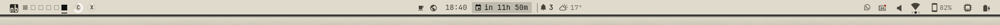
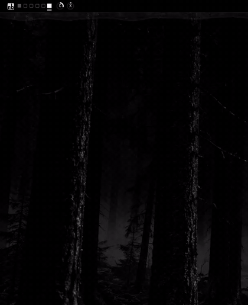
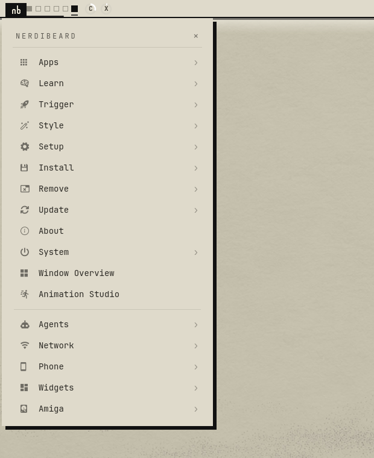
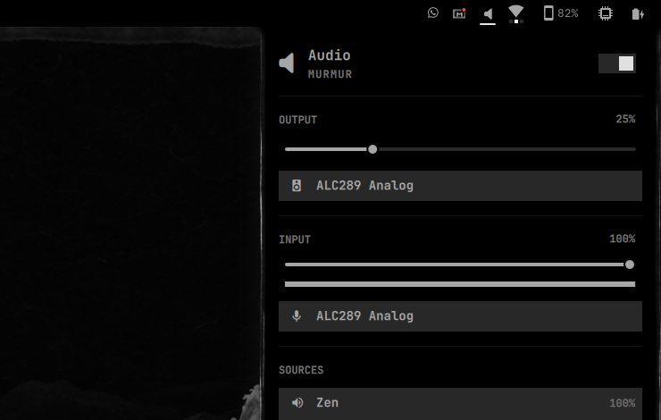

# Tusche Bar

Presets, modules and motion for the **native** Omarchy bar, made for the Tusche & Papier themes (included). It adds:

- **Logo and workspaces:** a compact workspace row with your own logo (Omarchy, the Arch mark or the Nerdibeard seal);
- **Status:** AI quota gauges and status groups (network, phone, system);
- **Menu:** a drop-down logo menu that holds the whole Omarchy menu, searchable;
- **Popups:** your popups and Omarchy's own ones (volume, battery, Wi-Fi …) in the theme's material: rolling cards on Papier and Tusche, an ink bloom with a dried rim on the Lavur themes.

Everything is switchable in its own Control Center. The bar stays Omarchy's own: every widget keeps its own service. It works with any Omarchy theme; the material comes with themes that ship a `bar-material.json` (the four Tusche & Papier themes in `themes/`).




| Logo menu, Tusche Lavur | Logo menu, Papier | Omarchy's volume popup, Tusche Lavur |
|---|---|---|
|  |  |  |

Companions: [Tusche Island](https://github.com/nerdislb/omarchy-tusche-island) (clock, live activities and notifications) and [Card Picker](https://github.com/nerdislb/omarchy-card-picker) (themes and wallpapers as a hand of cards).

## Requirements

- **Omarchy:** a recent version with the Quickshell shell (the dev line of early October 2026 or later). The plugin uses Omarchy's panel and menu plugin kinds; an older Omarchy refuses its manifest, and the setup script checks that first.
- **Tools:** `git`, `jq`, `python3` and `rsync` (all present on Omarchy).
- **Session:** run the commands as your user in the desktop session.

## Install

### The whole look

Installs the four Tusche & Papier themes, this bar, the Tusche Island and the Card Picker, with the author's bar combination `paper`:

```sh
git clone https://github.com/nerdislb/omarchy-tusche-bar.git ~/src/omarchy-tusche-bar
~/src/omarchy-tusche-bar/setup/install.sh --dry-run   # shows every step, changes nothing
~/src/omarchy-tusche-bar/setup/install.sh
```

The script:

- backs up everything it touches first;
- clones the other two repositories into `~/src`;
- puts the island in the place of Omarchy's clock;
- restarts the shell and switches to Papier.

Options: `--theme tusche|papier-lavur|tusche-lavur`, `--no-card-picker` and `--boot-logo` (the seal on the boot screen, asks for sudo). Details are in [setup/README.md](setup/README.md). Undo with `setup/revert.sh <backup folder>`, which the script names at the end.

### Only the bar

```sh
git clone https://github.com/nerdislb/omarchy-tusche-bar.git ~/src/omarchy-tusche-bar
cd ~/src/omarchy-tusche-bar && ./dev-install.sh
omarchy-shell shell rescanPlugins
omarchy plugin enable nerdibeard.tusche-bar
omarchy restart shell
```

Then pick a look:

- **Control Center:** middle click on the bar's logo.
- **Preset:** `omarchy-shell tusche-bar preset tidy` (`tidy` or `focus`).
- **Single setting:** for example `omarchy-shell tusche-bar set logo arch`.

Your own bar layout is saved the first time and comes back with `omarchy-shell tusche-bar preset today`.

Menu entries and status groups for optional plugins only appear when those plugins are installed: Flux, Buds, OmaMail, WhatsApp, Proton VPN, the system monitor and others.

**Super+Space** can open the logo menu as a launcher: the search line is ready, apps lead the results, and Super+Alt+Space opens it on the Apps list. Switch it in the Control Center (Quick → Super+Space → Bar menu with search) or with `omarchy-shell tusche-bar set keys bar`; `… set keys omarchy` gives Omarchy's own menus back. It keeps one managed block in `~/.config/hypr/bindings.lua` (`bin/keybinds.py`), and when the bar is not running the keys still open Omarchy's menus. The whole-look install turns it on.

### Moving backgrounds (optional)

Very quiet 60-second loops of the theme stills: mist drifting through the
valleys, the lighthouse beam turning, dust in a shaft of light, cloud shadows,
and once a minute a few far birds or a falling leaf. The stills stay each
theme's default; the loops are extra backgrounds (`4-berge-bewegt.mp4` …) you
pick in the card picker or with `omarchy theme bg next`.

```sh
~/src/omarchy-tusche-bar/setup/motion-backgrounds.sh install   # ~25 MB from the GitHub release, checksummed
~/src/omarchy-tusche-bar/setup/motion-backgrounds.sh remove
```

Or `setup/install.sh --animated`. They are 1080p HEVC Main10 (decoded in
hardware on most machines); Omarchy pauses video backgrounds behind
fullscreen windows. `tools/motion-backgrounds/render.py` renders them from the
stills (numpy): every scene is a pure function of time, frame 60 s = frame 0.

### Coming from the Amiga Bar

The Tusche Bar and Island were called Amiga Bar and Amiga Island until October 2026. `setup/install.sh` carries such a setup over by itself: the options, saved combinations, base layout, island settings and state move to the new names (`setup/migrate-from-amiga.py`), the removed Amiga extras undo what they changed outside the plugin (fastfetch logo, desktop font profile, the A500 bar form), and the old plugin folders go into the backup.

## Update

```sh
git -C ~/src/omarchy-tusche-bar pull
~/src/omarchy-tusche-bar/dev-install.sh
omarchy restart shell
```

Re-running `setup/install.sh` updates all three repositories.

## Uninstall

```sh
omarchy-shell tusche-bar preset today      # your own bar layout back
omarchy plugin disable nerdibeard.tusche-bar
rm -r ~/.config/omarchy/plugins/nerdibeard.tusche-bar
```

After a whole-look install, `setup/revert.sh <backup folder>` is the complete undo.

---

The sections below are the reference: how it is built, every option, IPC and tests.

## Architecture

- `Engine.qml` — keep-loaded panel plugin (`nerdibeard.tusche-bar`): Control Center, presets, IPC. It writes `bar.layout` through `bin/apply-layout.py` (atomic, keeps shell.json's 0600 mode). The bar itself stays `omarchy.bar`.
- Why not a replacement bar: under a plugin bar, Omarchy hands third-party widgets a service-less shell facade (a security boundary), so OmaMail, WhatsApp and Flux would lose their own services.
- Own parts are custom QML modules in the layout (`{ "id": "tusche.x", "source": "<plugin>/modules/X.qml", ... }`); one plugin can register only one bar widget.
- `modules/Status.qml` mounts the widgets it folds away invisibly (`embeds`: id → original settings), so their native popups (Wi-Fi, Bluetooth, VPN, Tailscale, monitor, drive, radar, plugins, buds, system monitor) still open from our groups. Flux, OmaMail and WhatsApp are not embedded (they need their own services); Flux is read via `flux-cli` and opened as its window. Weather and world clocks stay native (their popups position via the centre section).
- The user's layout is captured once in `~/.local/state/tusche-bar/base.json`; **Today** restores it. Options live in this plugin's `plugins[]` entry.

## Elements and variants

| Element | Variants |
|---|---|
| Workspaces (`Workspaces.qml`, with the menu logo) | today, pips, stack, logo (the frame carries the number), minimap |
| AI quotas (`Quota.qml`) | today, gauge, vu, rings, ondemand |
| Right side (`Status.qml`) | today, groups, deviations — the system group shows a chip outline that fills from below like the battery (CPU in 6 rows, one row from 2 %); CPU > 85 % or RAM > 90 % turns only the fill to the alarm tone |
| Bar edge (`ThemeEdge.qml`) | none (default), theme (light & shadow from the theme's `bar-material.json`) — kept by presets |
| Logo (`ArchLogo.qml`, `SealLogo.qml`) | omarchy, arch (the official Arch Linux mark, unaltered, in the bar's ink), nerdibeard (the seal: nb cut out of a 16 px ink block); with native workspaces only the menu logo is replaced; the drop-down's title follows the logo |
| Centre (`Centre.qml`) | today, calm (temperature at the weather glyph) |
| Super+Space (`bin/keybinds.py`) | omarchy (Omarchy's menus, default), bar (the logo menu with the search line; Super+Alt+Space on the Apps list) — kept by presets |

Presets: `today` (your bar), `tidy` (pips · gauge · groups), `focus` (stack · on demand · deviations).

**Edge from the theme** (`edge: theme`) reads `bar-material.json` from the
current Omarchy theme (the Tusche & Papier themes ship one; other themes show
no edge) and follows theme switches. `edge.kind` `dry`: a line over the bar's
lower edge on Overlay (light in Tusche, ink in Papier), and under it a short
hard shadow, a glow and a still haze on the Top layer — while the workspace
has windows only in the gap above them (`general:gaps_out`), in full on an
empty one (on the Bottom layer Hyprland blends layer surfaces additively, so
a dark haze would never show). `kind` `lavur`: a pre-rendered wash
(`bar-lavur.png` in the theme) instead.

With the material, popups (drop menu, quota, status, and Omarchy's own) roll
out of the bar from the top in the theme's frame with its shadow (Papier: hard
ink, 6/6) or halo (Tusche), hanging flush from the bar
(`MaterialCard.qml`); the logo becomes an inverted tab while the drop menu is
open, and the hovered row inverts. A material card with `bloom` (the Lavur
themes) blooms instead of rolling: a drop falls out of the bar and grows to
the card's size as one sheet of wet paper (`InkSheet.qml`). Ink fills it (in
the tide colour, `tide`), the water clears it from the source
(`shaders/wetink.frag`) and its residue evaporates with the water; the
pigment dries into a rim at the calm edge – a blurred blob cut at a gently
noise-displaced threshold (`shaders/bloomcut.frag`), the rim just inside it
gathered in a few short denser sections, a broken faint drying line further
in (`shaders/restink.frag`, over the paper's mask blurred by
`shaders/gauss.frag`); all noise in the card's own coordinates. Under it a
halo: Papier a short soft ink wash, Tusche a flat dark seam plus a breath of
moonlight. The theme tunes it with `card.rest` (`ridge`, `pool`, `echo`,
`residue`, `halo` parts with `color`, `alpha`, `blur` = σ in px, `dx`, `dy`,
`spread`, `dh`). The compiled `.qsb` files ship next to the shaders; rebuild
one with `qsb --glsl "100 es,120,150" --hlsl 50 --msl 12 -o shaders/X.frag.qsb shaders/X.frag`.
The drop menu's hover is then a brush stroke (`brush`, a PNG in the theme
folder). With `tones.strong` the bar's own text is the quieter tone (the
theme sets it) and logo and the active workspace's number stay strong. The
Tusche Island takes the same material for its notes. Reduced Motion: the
roll and the bloom jump, the content fades.

AI usage records (`~/.local/state/omarchy/agents/usage`) are refreshed by
`omarchy.agents` only while it sits in the bar. When a variant folds the AI
widgets away, the engine runs `omarchy-agent-usage-update` itself with that
widget's interval and disabled providers (retrying advised limits after 30 s),
and fetches limits when the quota popup opens. A limit past its reset time
always counts as reset (0 %), even before a fresh record arrives.

## Logos: Arch and the Nerdibeard seal

Expressive only once, when the logo arrives (the bar starts or the option
switches to it), then still – no hover effect, no loop.

- `arch` (`modules/ArchLogo.qml`): the first path of
  `/usr/share/pixmaps/archlinux-logo.svg` (package filesystem) without the ™,
  one fill in the bar's strong ink, 1.18 × the 18 px field (the triangle
  reads lighter than a square glyph), centred like the Omarchy glyph.
  Arrival: one fade, 0.22 s (reduced motion 0.12 s). The tab inverts it.
- `nerdibeard` (`modules/SealLogo.qml`): a 16 × 16 block with a 1 px rim and
  the initials nb cut out in squared seal script, whole pixels, its top line
  on the workspace frame's. Arrival: one impression, 0.32 s – the ink at the
  letters' edges prints at once, the rest soaks out to the rim in a fixed
  order. Press: the ink takes the tab's tone. Drop-down (theme material): the
  ink runs out of the seal into the tab once (0.24 s, a rounded front, the nb
  readable throughout); closing restores the rest state once the card is
  back. Reduced motion: 0.12 s cross-fades.

Switch: Control Center → Logo, or `omarchy-shell tusche-bar set logo
omarchy|arch|nerdibeard`.

## Boot screen logo (Plymouth)

`bin/boot-logo.py set nerdibeard|arch [--theme NAME]` puts the seal (a
finished stamp impression, a fifth smaller than the 230 px logo box, set a
touch crooked) or the unaltered Arch mark on the boot screen that asks for
the disk password, in the theme's foreground on its background (default: the
current theme). The marks are 240 × 240 alpha masks (`assets/boot/*.alpha`);
the script composes the PNG under `~/.local/state/tusche-bar/boot-logo/` and
hands it to Omarchy's `omarchy-plymouth-set`, which asks for the sudo
password and rebuilds the initramfs. `restore` puts the theme's own
unlock.png back (`omarchy-plymouth-set-by-theme`), `restore --default`
Omarchy's logo; `status` tells what the boot screen shows. The boot screen
does not follow the bar's logo option or theme switches by itself (each
change needs sudo). Test: `python3 tests/boot_logo.py`.

## Logo menu

- `DropMenu.qml`: left click on the logo (or `omarchy-shell tusche-bar menu`) folds out one tall menu under the logo; with the theme material it rolls or blooms out of the bar like the other popups. Its first level is the Omarchy menu itself, Apps to System — `omarchy-menu.jsonc` read by `OmarchyMenuSource.qml` with Omarchy's own model library (`vendor/MenuModel.js`, unchanged copy) including `when:`/`checked:`/`disabled:` guards. **More** holds what `~/.config/omarchy/extensions/omarchy-menu.jsonc` adds to the root (Window Overview …) and our groups Agents · Network · Phone · Widgets · Tusche (Control Center, island, Terminal, Do not disturb, Stay awake, Transparent bar); extension entries under an Omarchy submenu stay there. `omarchy-shell tusche-bar search` (Super+Space) opens it as a launcher: the search line is shown, apps come first, then menu entries with their path; `… apps` (Super+Alt+Space) opens it on the Apps list. Submenus open inside it (‹ back), typing searches the whole tree and lists matching apps after the menu hits (at most 8); ↑↓, PgUp/PgDn, Enter/→, ←/Backspace, Esc. Right click on the logo: Omarchy's own centred menu. Middle click: the Control Center.
- Nested like the native menu, so a pick in the drop-down never ends in the centred menu:
  - **Lists the shell fills in** open as levels inside it: **Apps** from the shell's application library (the facade Omarchy hands to plugins of kind `menu` — hence `"menu"` next to `"panel"` in `manifest.json`; the plugin still loads as the same keep-loaded panel), alphabetical with the apps' own icons, launched like the native menu; **Font** and power profiles with the native menu's own bash providers (✓ on the current value). Typing inside a list filters it. Without the library (older shell) or for an unknown provider the native menu opens there as before.
  - **Questions** an action asks through `omarchy-menu-select` / `omarchy-menu-input` (Keybindings, Timezone, the plugin rows, Remove › TUI/Theme/Web App, Transcode …) are answered inside it. Every Omarchy action started from the drop-down runs with `bin/menu-shim` first on its `PATH`; those two shims take the same arguments, stdin and file protocol as Omarchy's commands and hand the payload to `omarchy-shell tusche-bar ask`. When no drop-down takes it (no Tusche Bar, no logo shown, shell not answering) they run Omarchy's own command with the same prompt, options (stdin included) and menu arguments. An action known to ask keeps the drop-down open on a waiting level that turns into the question, or closes when the action ends without asking (at the latest after 3 s). The answer is written as the native menu writes it (the selection file, then the done file); Esc, ×, a click outside, ‹ and every other close cancel (the done file alone), so no script is ever left waiting. `tusche-bar state` shows `ask`.
- Omarchy's own popups take the theme material too (`NativeMaterial.qml`): the status module finds the KeyboardPanel of every Omarchy widget it folds (network, Bluetooth, Tailscale, monitor …) and of Omarchy's panel widgets that stay in the native bar (audio, power, weather, world clock …; it keeps watching, as Omarchy may create them later or anew) and hangs a `MaterialCard` into it, as our own popups declare one. Omarchy's code is untouched; widgets keep their own (trusted) bar and services. A popup the search does not recognise keeps Omarchy's look; without a material nothing changes. `tusche-bar state` shows `natives`.

## Control Center

`ControlCenter.qml` (pure model in `ControlCenter.js`): Quick · Configure,
areas on the left (Quick, Tusche Bar, Tusche Island, Card picker, Health),
editor on the right, Ctrl+K search over settings and their values, a Health
chip. Edits are staged and confirmed explicitly:

- **Use** applies the staged changes live; the window stays open.
- **Save** applies what is still staged and closes.
- **Cancel** (button, ×, Esc once the search is closed, click outside, or any
  other close) restores the state from opening if Use applied something, then
  closes.

Bar options go out as one write (each write rebuilds the bar), island settings
through `omarchy-shell tusche-island set …`, the card picker through its
`menu-override.py`; one step at a time, each confirmed before the next. Health
only reports live checks (base layout, AI usage refresh, notification takeover
marker, card picker override, last write, saved combinations).

## Saved combinations

The Control Center's Tusche Bar area includes **My combinations**. Enter a name
and choose **Save / replace** (saves the options as shown, staged ones
included); select a saved name to stage it like a preset, or × to remove it.
These are variant selections, not snapshots of accounts or the whole desktop.
Data stays in `~/.local/state/tusche-bar/presets.json`.
IPC: `omarchy-shell tusche-bar save "My focus"` / `... load "My focus"`.

Folded widgets receive a presentation-only adapter, not access to another
plugin's services. Native Wi-Fi QR/speed-test and monitor OSD actions are
explicitly routed; member settings are stored in their `embeds` entry and
carried into the restoration baseline before the next preset switch.
`recaptureBase` refuses while our modules are in the bar and a baseline
exists: restore **Today** first. If `base.json` is lost while our modules are
in the bar, the baseline is rebuilt from them (each module turns back into the
native widgets it replaced, folded widgets keep their settings; order inside a
group may differ) and `state` reports it in `lastResult`.

## IPC

- `omarchy-shell tusche-bar options` (Control Center, toggle) · `cc quick|bar|island|cards|health` · `preset today|tidy|focus` · `set <element> <variant>` · `save|load <name>` · `menu` (drop-down) · `search` (drop-down as a launcher) · `apps` (drop-down on the Apps list) · `recaptureBase` · `state`.
- Module IPC (tests, keybinds): `tusche-quota toggle|state`, `tusche-status group net|phone|system|all`, `tusche-status member <widget-id>`, `tusche-centre state`.
- `tusche-bar ask <payload>` is the menu shims' entry (an `omarchy-menu-select`/`-input` payload; answers `ok` when a drop-down took it).

## Develop

`OMARCHY_PATH=/path/to/omarchy ./dev-install.sh`. Custom modules and the `.pragma library` Presets.js are cached by the running shell: after code changes run `omarchy restart shell`, then re-apply a preset. Each preset change rebuilds the bar (widgets such as AI usage need 2–3 s). A changed `kinds` list in `manifest.json` also needs the restart: the shell builds a plugin's scoped facade (and the app library in it) when it loads the plugin.

Tests: `node tests/regressions.cjs` (with the Tusche Island checkout next to this repository) and `python3 tests/boot_logo.py`.

## Licences and trademarks

- **Code:** MIT (`LICENSE`).
- **`vendor/MenuModel.js`:** an unchanged copy of Omarchy's menu model library (Omarchy, MIT).
- **Trademarks:** the Arch Linux logo (drawn unaltered in `modules/ArchLogo.qml`, used under the [Arch Linux trademark policy](https://terms.archlinux.org/docs/trademark-policy/) for non-commercial community use) and the Omarchy logo belong to their owners. This is an independent project; no affiliation or endorsement is implied.
